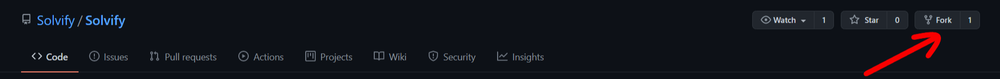
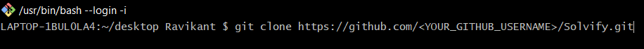
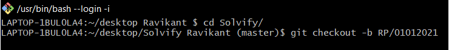
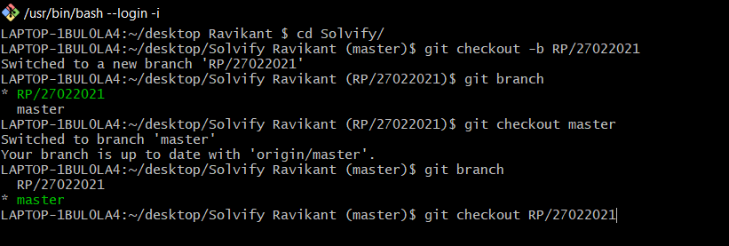
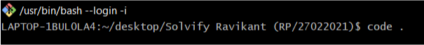
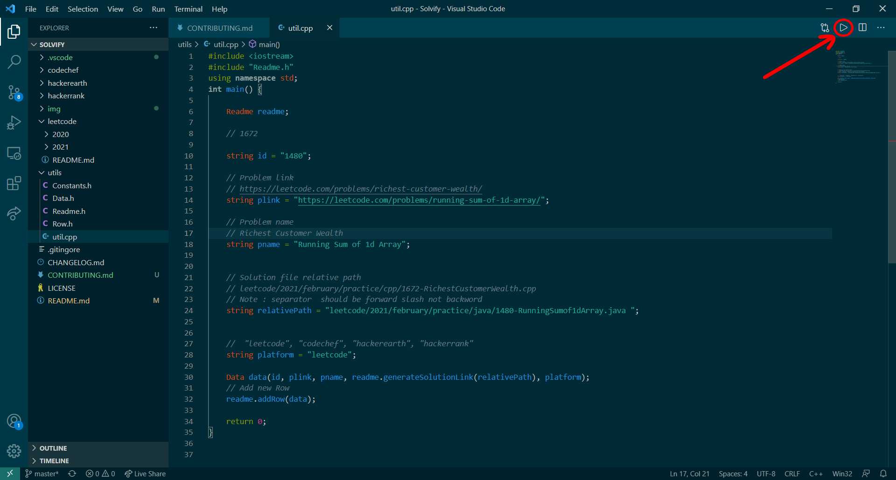
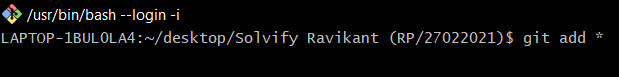
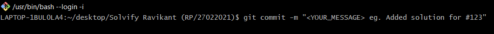
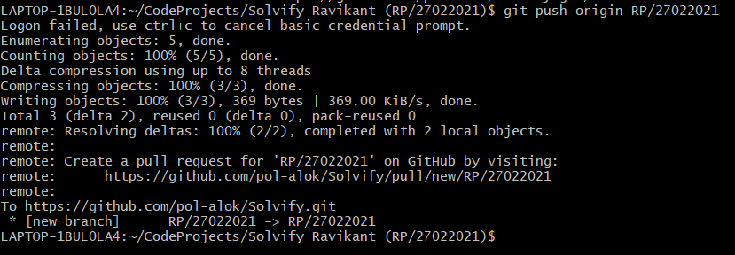
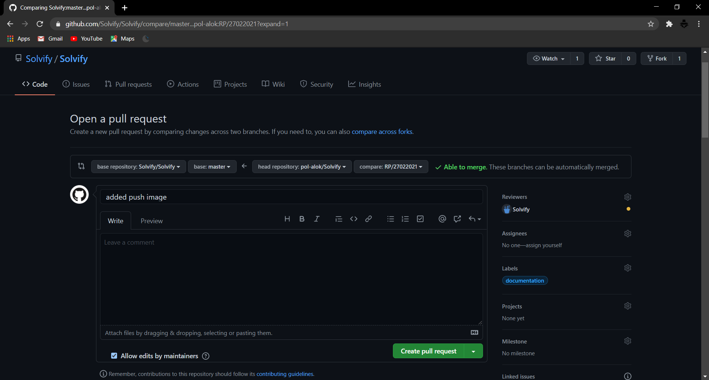

# Contributing Guidelines

### Learn how to Setup Coding Environment, Fork a repo, makes changes, and ask the maintainers to review and merge it

## Setup Coding Environment

> Follow the below tutorial for your preferred language to set up the coding environment

| language |                                                                  C++                                                                  |                                                                 Java                                                                  |                                                              JavaScript                                                               |                                                                Python                                                                 |
| :------: | :-----------------------------------------------------------------------------------------------------------------------------------: | :-----------------------------------------------------------------------------------------------------------------------------------: | :-----------------------------------------------------------------------------------------------------------------------------------: | :-----------------------------------------------------------------------------------------------------------------------------------: |
| Tutorial |  |  |  |  |

## Creating Pull Request

You have a GitHub repo and can push to it. All is well. But how the heck do you contribute to other people's GitHub projects? That is what I wanted to know after I learned git and GitHub. I will explain how to fork a git repo, make changes, and submit a pull request.

> - When you want to work on another's GitHub project, the first step is to fork a repo.   

---

> - Once there click on the Fork button in the top-right corner. This creates a new copy of the repo under your Github user account.
> - Clone this Github repo. Open up the GitBash/Command Line and type in:    
> - Don't forget to write your GitHub user name.

---

> - `cd` into the specific directory.
> - Now create a branch of the master by pushing the command:
>   - **git branch -b < FIRST_LETTER_OF_YOUR_FIRST_NAME_AND_FIRST_LATTER_OF_YOUR_LAST_NAME/CURRENTDATE >**.
>   - Example : `git checkout -b RP/01012021`    

---

> - You can now check the branches by pushing in the command: `git branch`. You will see the Master Branch and another branch along with your branch.
>   > - Switch to Development Branch. Never develop on Master Branch. Push in the command: git checkout < NEWLY_CREATED_BRANCH >.
>   > - **_:warning: Note:_** _Created branch should be pushed on that day only when it was created, So for eatch day you have to create new branch and push end of the day._   

---

> - Open project on vs code by command : `code .` in current diractory.
>    

---

> #### To create new file for your solution please follow below points
>
> - Your files should be uploaded directly into the corresponding folder
>   - (e.g. if you solve a problem from leetcode in january 2021 in cpp, it goes inside the `leetcode folder` within `2021 folder` within the `january folder` with in the `cpp folder` and so on)
> - Under no circumstances create new folders within the language folders to upload your code unless specifically told to do so.
> - Start Coding. Make apt commits with proper commit messages. Always use git status to see that you have not made changes on the file you were supposed not to.
> - If you check all working fine then
> - Add entry in `CHANGELOG.md` as per below in your section if not then create your section.
>   - `- <PLATFORM_NAME>: <PROBLEM_NAME> (#<PROBLEM_ID>)`
> - Open `util.cpp` then set all the values in the variables without space.
> - Run by hitting play button on right hand corner.
>    
> - Deleted all the compiled/interpreted file.
> - Add all the changes with this command: (`git add *`). This will add the changes to your present workspace.
>    

---

> - Make a commit. This will save a snapshot of your Project.
>    

---

> - Push the changes: `git push`.
>    

---

> - Once you push the changes to your repo, Copy the link and pase in browser then Compare & create pull request will appear in GitHub.
>    

---

> - Open a pull request by clicking the Create pull request button. This allows the repo's maintainers to reviews your work. From here, they can merge it if it is good, or they may ask you for some changes.

## Here are some 7 Rules

#### You should be following while doing Open-Source to make your Contributions shine during the whole process:

- Be Nice, Be Respectful (BNBR)
- Make proper commit messages and document your PR well.
- Always add Comments in your Code and explain it at points.
- Squash your commits before you push them.
- Always create a Pull Request from a Branch; Never from the Master.
- Follow proper Code conventions. Using i, j in Loops show a poor understanding of Code Quality. Use proper Variable, Function Names.
- Code would be reviewed by Mentors before they are merged. Every PR requires min 2 Reviews.
