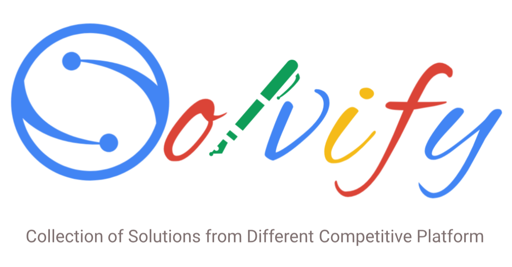

 
    

## Overview

This repository contains the best solutions for practice, daily, weekly, and long challenge from [`#LeetCode`](https://github.com/Solvify/Solvify/tree/master/leetcode), [`#CodeChef`](https://github.com/Solvify/Solvify/tree/master/codechef),[`#HackerRank`](https://github.com/Solvify/Solvify/tree/master/hackerrank) and [`#HackerEarth`](https://github.com/Solvify/Solvify/tree/master/hackerearth) platforms.
 
If you think you can solve a question from any competitive platform better than anyone and let other know your approach.
Then we welcome your PR.

## Contents

Currently, we are covering four platforms ( [`#leetcode`](https://leetcode.com/), [`#codechecf`](https://www.codechef.com/), [`#hackerrank`](https://www.hackerrank.com/), [`#hackerearth`](https://www.hackerearth.com/) ) and four language `C++`, `Java`, `JavaScript`, `Python`.
 
But you can Create PR with your favorite language.

## Platforms

## Contributing Guidelines

- Review code by your own before creating PR.
- Make sure code will be well formatted and indented.
- Make sure your code works before submitting it.
- Follow [this](/CONTRIBUTING.md) tutorial to add the solution in respective Readmes.

## Our Contributors ✨

<table>
      <tr>
        <td align="center" >
            <a href="https://pol-alok.github.io/portfolio/">
                
                 
                 
                <b>Ravikant Pal</b>
            </a>
             
            <a href="https://github.com/Solvify/Solvify/commits?author=pol-alok" title="Activity">📋</a>
        </td>
        <td align="center" >
            <a href="#">
                
                 
                 
                <b>Manjesh Kumar</b>
            </a>
             
            <a href="https://github.com/Solvify/Solvify/commits?author=manjesh317" title="Activity">📋</a>
        </td>
        <td align="center" >
            <a href="#">
                
                 
                 
                <b>Sachin Kumar</b>
            </a>
             
            <a href="https://github.com/Solvify/Solvify/commits?author=sachin200697" title="Activity">📋</a>
        </td>
        <!-- <td align="center" >
            <a href="https://tesseractcoding.github.io/">
                
                 
                 
                <b>Sikandar Kumar</b>
            </a>
             
            <a href="https://github.com/Solvify/Solvify/commits?author=born-2learn" title="Activity">📋</a>
        </td> -->
      </tr>
</table>

## Code of Conduct

You can find our Code of Conduct [here](/CODE_OF_CONDUCT.md).

## License

This project follows the [MIT License](/LICENSE.md).
